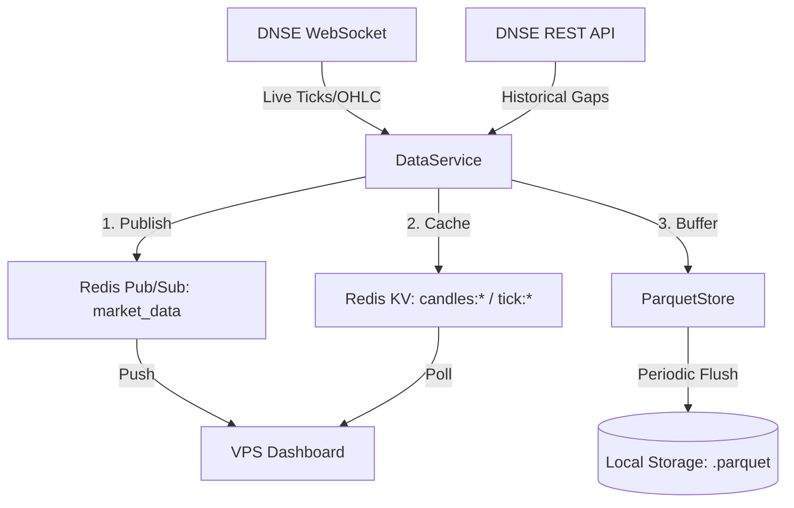

# DNSE Service Architecture

This document describes the internal architecture and data flow of the **DNSE Market Data Service**.

## 🏗️ System Overview

The `dnse_service` is a high-performance market data orchestrator designed to provide low-latency data to the Alpha Engine ecosystem. It manages three primary concerns: **Real-time Broadcasting**, **High-speed Persistence**, and **Historical Data Recovery**.

---

## 🧩 Core Components

### 1. DataService (`main.py`)
The orchestrator. It manages the lifecycle of the WebSocket connection and coordinates data distribution.
- **WebSocket Handlers**: Listens for `trade`, `quote`, and `ohlc` events.
- **Bootstrap Logic**: On startup, it calculates missing data for the current day and attempts to fill it via the DNSE REST API.
- **Fallback Engine**: If live data fails, it attempts to load the most recent data from local Parquet or legacy CSV files to ensure the dashboard never starts empty.

### 2. ParquetStore (`ParquetStore` class)
A specialized storage layer optimized for time-series data.
- **Buffering**: Accumulates OHLCV bars in memory to minimize disk I/O.
- **Compression**: Uses `snappy` compression for an ideal balance between speed and disk usage.
- **Deduplication**: Merges new data with existing daily files, ensuring no duplicate timestamps exist.
- **Daily Partitioning**: Organizes data by `{SYMBOL}/{YYYY-MM-DD}.parquet` for easy retrieval.

### 3. Redis Integration
Redis acts as the real-time data bus:
- **`market_data` (Pub/Sub)**: Used for millisecond-latency UI updates.
- **`candles:{symbol}:{tf}` (String/JSON)**: Stores the last 1000 bars for various timeframes (1m, 5m, 15m, etc.) for instant dashboard loading.
- **`tick:{symbol}`**: Stores the absolute latest price and timestamp.

---

## 🔄 Data Lifecycle

### Live Data Flow
1.  **Reception**: `TradingClient` receives a raw WebSocket packet.
2.  **Normalization**: Data is converted into a standard internal dictionary format.
3.  **Broadcast**: Published immediately to Redis `market_data`.
4.  **Buffering**: OHLC bars are added to the `ParquetStore` memory buffer.
5.  **Flushing**: Every 60 seconds, the buffer is merged and written to disk as a `.parquet` file.

### Historical Sync (Bootstrap)
1.  **Gap Calculation**: Determines the time range from `today_00:00` to `now`.
2.  **API Fetch**: Requests 1m bars from DNSE REST API.
3.  **Local Fallback**: If API fails (e.g., rate limits or after hours), it searches `data/ohlcv/` for the latest daily file.
4.  **Population**: Fills Redis caches so the Dashboard can render the "Full Day" view immediately.

---

## 🛠️ Resilience Features

-   **Auto-Reconnect**: The WebSocket client automatically retries connections with exponential backoff.
-   **Signal Handling**: Gracefully flushes all memory buffers to disk upon receiving `SIGINT` (Ctrl+C) or `SIGTERM`.
-   **Atomic Writes**: Parquet files are written in a way that minimizes corruption risk during crashes.

---

## 📊 Directory Mapping

| Path | Purpose |
| :--- | :--- |
| `dnse_ws/` | Python SDK for DNSE (Internal) |
| `data/ohlcv/` | Primary data repository (Parquet) |
| `data_service.log` | Detailed execution logs |
| `migrate_csv.py` | Utility to convert legacy CSV data to Parquet |
